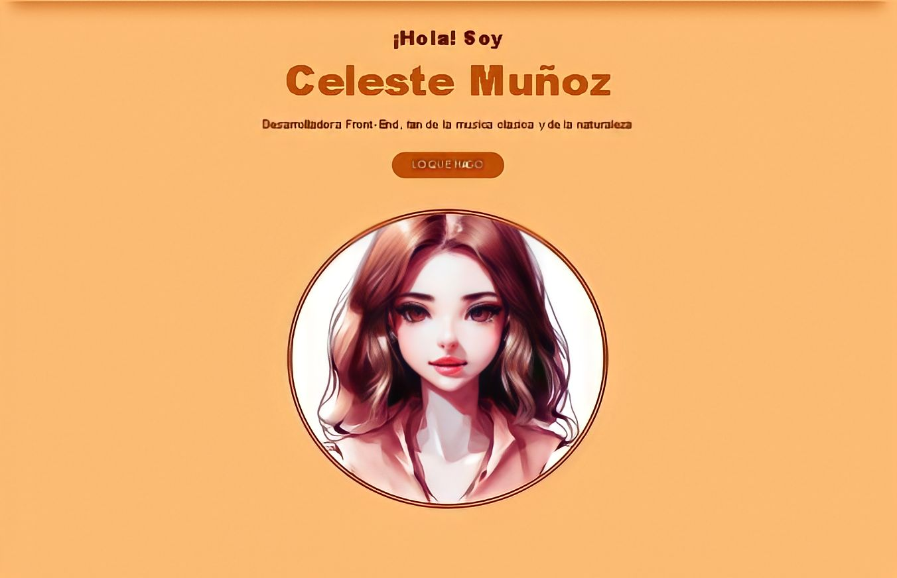

# ***¡BIENVENIDO A MI PORTAFOLIO!***

## Consigna
Este es el primer proyecto a presentar a ADAITW, en donde realizamos la estructura y los estilos de nuestro portafolio web, utilizando las siguientes herramientas:

## Criterios de aceptación
### Los requisitos mínimos para que el proyecto sea considerado para la entrega son:
### Lista
* Se debe respetar el siguiente [diseño](https://frontend-proyecto-portfolio.adaitw.org/)
* **Pueden modificarse colores, tipografías e imágenes**
* El portfolio debe contar con:
    * Header con links de navegación
    * Sección de presentación
    * Sección de habilidades
    * Cita
    * Sección de proyectos con grilla de proyectos
    * Sección y formulario de contacto
    * Footer con links de navegación y links de contacto
* Al clickear en los links de navegación, debe llevar a la sección correspondiente
* Al clickear en los links de contacto, debe llevar a la página externa correspondiente
* El portfolio debe tener un diseño responsivo y verse correctamente en distintos dispositivos (especialmente mobile)
* El portfolio debe estar deployado y ser accesible desde una URL
* El repositorio en GitHub debe tener un readme adecuado

[Ver sitio web deployado](https://celesteselena2022.github.io/Portafolio/)